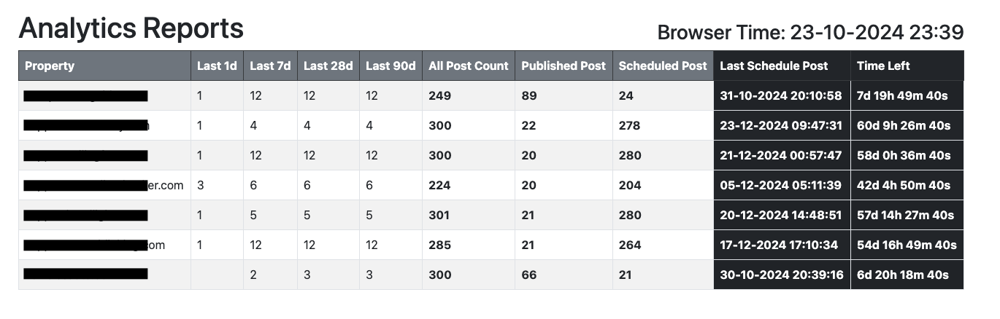

# GA4 Wordpress Tracker

This is simple tracker for scheduled posts and Google Analytics data for your wordpress website.




### Google Analytics
- enable [Google Analytics API](https://console.cloud.google.com/marketplace/product/google/analytics.googleapis.com) on Google Cloud
- enable [Google Analytics Data API](https://console.cloud.google.com/marketplace/product/google/analyticsdata.googleapis.com) on Google Cloud
- enable [Google Analytics Admin API](https://console.cloud.google.com/marketplace/product/google/analyticsadmin.googleapis.com) on Google Cloud
- create a Service Account on the [Credentials](https://console.cloud.google.com/apis/credentials) Page
  - follow this [documentation](https://docs.lacework.net/compliance/gcp-create-a-service-account-and-grant-access) and make sure to have JSON file at the end
  - download the JSON file and place it under the `app/` folder and rename it to `account.json`
- create a file called website.txt
  - use the example file in the `app/` folder.
  - the structure of file goes like: domain|Google Analytics Property Id. Such as: google.com|123456789
  - remove the prefix `p` from the property ID


### Wordpress

Add the following code to your theme's `function.php` file

```php
add_action('rest_api_init', function () {
    register_rest_route('custom/v1', '/post-stats', array(
        'methods' => 'GET',
        'callback' => 'get_post_stats',
        'permission_callback' => '__return_true',
    ));
});

function get_post_stats() {
    $all_posts_count = wp_count_posts();
    $total_posts = $all_posts_count->publish + $all_posts_count->draft + $all_posts_count->future + $all_posts_count->pending;
    $published_posts_count = $all_posts_count->publish;
    $scheduled_posts_count = $all_posts_count->future;

    $args = array(
        'post_type' => 'post',
        'post_status' => 'future',
        'posts_per_page' => 1,
        'orderby' => 'date',
        'order' => 'DESC',
    );
    $last_scheduled_post = get_posts($args);

    $response = array(
        'total_post_count' => $total_posts,
        'published_post_count' => (int) $published_posts_count,
        'scheduled_post_count' => (int) $scheduled_posts_count,
        'last_scheduled_post' => !empty($last_scheduled_post) ? $last_scheduled_post[0]->post_date_gmt : null,
    );

    return rest_ensure_response($response);
}
```
